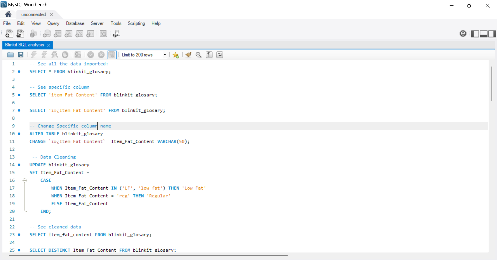
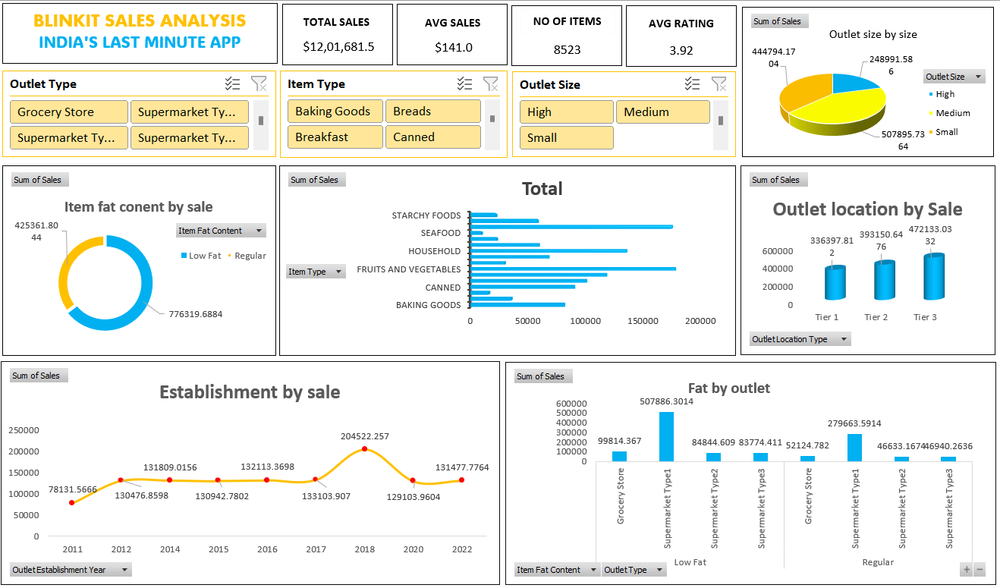

# 🟡 Blinkit Sales Dashboard – SQL & Excel
### 📊 SQL 

---

### 📊 Excel

### 📊 Project Overview  
This project analyzes Blinkit’s sales data using **SQL** for data cleaning and KPI generation, and **Excel** for dashboard creation and visualization.  
The goal was to uncover actionable insights on outlet performance, product demand, and sales trends — enabling data-driven decisions for business optimization.

---

### 🧮 Tools & Technologies  
- **SQL** – Data cleaning, transformation, and KPI calculation  
- **Excel** – Pivot tables, charts, and dashboard creation  
- **Power Query (Excel)** – Data transformation and automation  

---

### ⚙️ Project Workflow  
1. **Data Extraction & Cleaning (SQL):**  
   - Removed inconsistencies, duplicates, and null values  
   - Standardized column names and product categories  
   - Created KPIs such as `Total Sales`, `Average Rating`, and `Outlet Performance`

2. **Data Validation (Excel):**  
   - Imported SQL-cleaned data into Excel  
   - Verified KPI accuracy through pivot tables and filters  
   - Applied conditional formatting for quick anomaly detection  

3. **Dashboard Creation (Excel):**  
   - Designed an interactive dashboard using **pivot charts and slicers**  
   - Visualized performance by **Outlet Type, Location, and Product Category**  
   - Added KPI cards for quick summary insights  

---

### 📈 Key Insights  
- **Tier 3 outlets** generated the highest total sales and revenue growth.  
- **Medium-sized outlets** delivered the best profit-to-cost balance.  
- **Low Fat products** maintained consistent sales across multiple regions.  
- The **Excel dashboard** enabled dynamic exploration by outlet size, product type, and location.  

---

### 🚀 Key Features  
✅ KPIs at a glance – Total Sales, Average Rating, and Outlet Performance  
✅ Interactive Excel dashboard with dynamic slicers and charts  
✅ Automated data refresh through Power Query  
✅ Region and product-level performance insights  

---

### 🧭 Business Impact  
- Provided clarity on **top-performing outlets** and **high-demand product lines**.  
- Enhanced reporting accuracy and reduced manual analysis effort.  
- Supported strategic decisions for **regional expansion** and **inventory management**.  

---

### 📂 Project Files  
- `Blinkit_SQL_Queries.sql` – SQL scripts for cleaning and KPI creation  
- `Blinkit_Sales_Dashboard.xlsx` – Interactive Excel dashboard  
- `README.md` – Project documentation  

---

### 🧑‍💻 Developed By  
**Vaibhav [Your Last Name]**  
📧 [Your Email Address]  
🔗 [LinkedIn Profile] | [GitHub Profile]

---

### 🏷️ Tags  
`SQL` `Excel` `Dashboard` `Data Analysis` `Business Insights` `Data Cleaning` `KPI`

